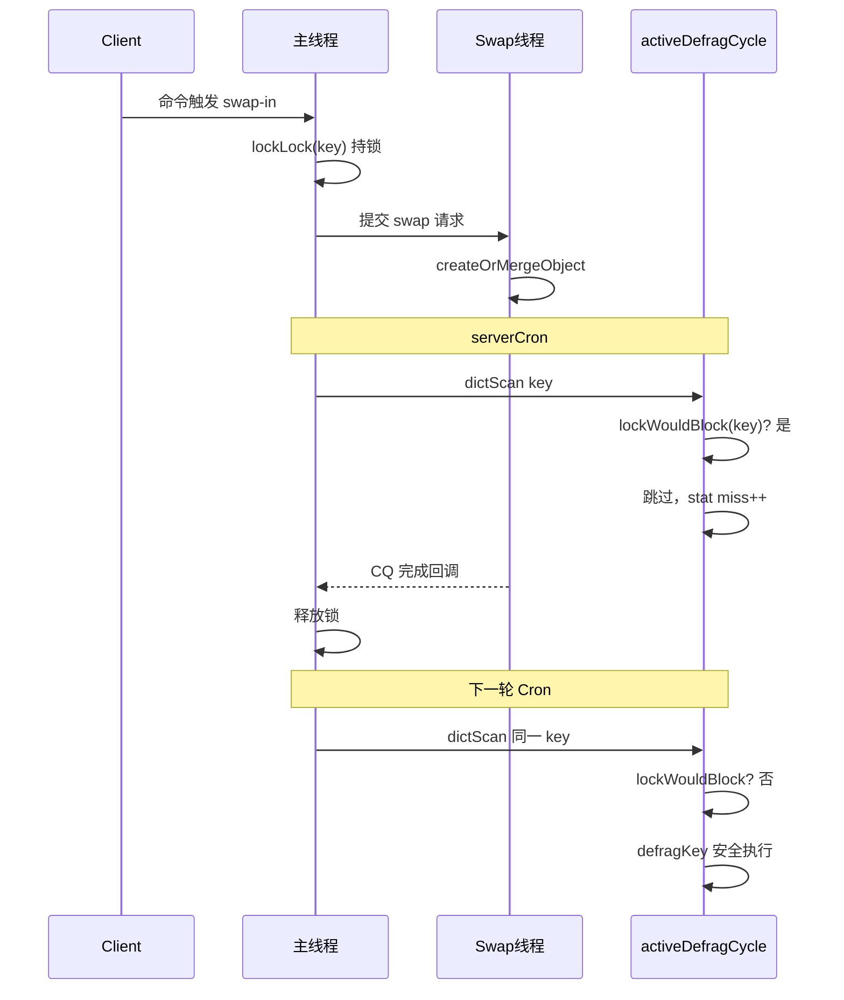

# Active Defrag × Swap 并发问题分析与设计方案

> 适用版本：Redis-On-Rocks 6.x（`make SWAP=1`，`ENABLE_SWAP`）  
> 相关文档：[memory-fragmentation-swap-analysis.md](./memory-fragmentation-swap-analysis.md)

---

## 一、背景

在 Swap 模式下同时开启 `activedefrag yes` 时，主线程的 `activeDefragCycle` 与 Swap 工作线程可能**并发访问同一 key 的内存对象**，且 Defrag 移动 key 名时未同步 `db->meta`，存在数据竞争与 UAF 风险。

本方案参考 **expire 主动过期**在 Swap 模式下的加锁跳过策略，对 Defrag 遍历做同等保护：**Swap 锁已占用的 key 不做碎片整理**。

---

## 二、问题分析

### 2.1 线程模型

| 执行体 | 路径 | 对 key 的操作 |
|--------|------|---------------|
| 主线程 | `serverCron` → `activeDefragCycle` → `dictScan` → `defragKey` | 移动 sds/robj/容器内部指针 |
| Swap 线程 | `swapExecBatchExecuteIn/Out` → `createOrMergeObject` / `cleanObject` | 合并/删除 Hash/List/Set/Zset 字段 |
| 主线程 | `asyncCompleteQueueProcess` → `swapRequestMerge` | 更新 keyspace/meta |

Swap 代码已注明大对象可能在 Swap 线程被修改，主线程无锁遍历不安全：

```c
/* src/ctrip_swap_object.c */
/* For big Hash/Set/Zset object, object might changed by swap thread in
 * createOrMergeObject, so iterating those big objects in main thread without
 * lockLock is not safe. */
```

`activedefrag` 恰恰在主线程深度遍历这些结构，且**不经过 Swap 锁**。

### 2.2 Swap 锁的保护范围

Swap 锁（`lockLock` / `lockWouldBlock`）保护的是**客户端命令路径**上的 key 互斥：

```c
/* src/ctrip_swap.c */
/* swap and main thread will not touch the same key in parallel. */
```

该保证仅适用于**持锁的 client 请求**，不覆盖 `serverCron` 中的 Defrag。

### 2.3 `db->meta` 共享 key 指针

`dbAddMeta` 与 `db->dict` **共享同一 sds 指针**：

```c
dictAdd(db->meta, dictGetKey(kde), m);
```

原 `defragKey` 只同步 `db->expires`，移动 key 后 `db->meta` 仍指向已 `zfree` 的旧 sds → **UAF**。

### 2.4 风险矩阵

| 场景 | 风险 | 加锁跳过能否缓解 |
|------|------|------------------|
| Swap-in/out 进行中，Defrag 改 value | 数据竞争 | ✅ 是（Swap 持锁期间跳过） |
| Defrag 移动 key sds，meta 未更新 | UAF / lookup 失败 | ❌ 需额外同步 meta |
| 纯 cold key（value 不在内存） | 低 | ✅ 跳过无影响 |
| DB/Server 级 Swap 锁 | 整库/实例被锁 | ✅ `lockWouldBlock` 可检测 |

---

## 三、参考实现：Expire 的加锁跳过

`activeExpireCycleTryExpire` 在 Swap 模式下，过期前先检测锁：

```c
/* src/expire.c */
#ifdef ENABLE_SWAP
        if (lockWouldBlock(server.swap_txid++,db,keyobj)) {
            /* 有进行中的 swap/expire 请求，跳过，避免重复提交 */
            expired = 0;
        } else {
            client *c = server.swap_expire_clients[db->id];
            submitExpireClientRequest(c,keyobj,force);
            expired = 1;
        }
#endif
```

Evict 路径同样使用 `lockWouldBlock`：

```c
/* src/ctrip_swap_evict.c */
    if (lockWouldBlock(server.swap_txid++, db, key)) {
        if (evict_result) *evict_result = EVICT_FAIL_SWAPPING;
        return 0;
    }
```

**设计原则**：后台 Cron 任务**不抢锁、不阻塞**，仅对**当前可安全访问**的 key 操作；被锁 key 留待下轮周期重试。

---

## 四、设计方案

### 4.1 总体策略

```
activeDefragCycle (主线程)
    │
    ├─ dictScan → defragScanCallback
    │       └─ lockWouldBlock? → 跳过（计 miss）
    │
    ├─ defragLaterStep（大 key 延后整理）
    │       └─ lockWouldBlock? → 轮转队列，下轮再试
    │
    └─ defragKey（实际整理）
            ├─ lock 已在 callback 层检查
            └─ 移动 key sds 时同步 meta / dirty_subkeys / expires
```

### 4.2 核心 API

复用现有 Swap 锁探测接口，**只读、不持锁**：

```c
/* src/ctrip_swap_lock.c */
int lockWouldBlock(int64_t txid, redisDb *db, robj *key);
```

封装为 Defrag 专用 helper（`defrag.c`）：

```c
#ifdef ENABLE_SWAP
static int activeDefragKeyLocked(redisDb *db, sds key) {
    robj *keyobj = createStringObject(key, sdslen(key));
    int locked = lockWouldBlock(server.swap_txid++, db, keyobj);
    decrRefCount(keyobj);
    return locked;
}
#endif
```

与 expire 一致：每次检测使用递增的 `server.swap_txid++`，保证 txid 单调性。

### 4.3 修改点

#### 4.3.1 `defragScanCallback` — 主字典扫描

在调用 `defragKey` 前检查：

```c
void defragScanCallback(void *privdata, const dictEntry *de) {
    redisDb *db = (redisDb*)privdata;
#ifdef ENABLE_SWAP
    if (activeDefragKeyLocked(db, dictGetKey(de))) {
        server.stat_active_defrag_key_misses++;
        server.stat_active_defrag_scanned++;
        return;
    }
#endif
    long defragged = defragKey(db, (dictEntry*)de);
    ...
}
```

#### 4.3.2 `defragLaterStep` — 大 key 延后队列

队头 key 被锁时，**移到队尾**后处理下一个，避免队头阻塞：

```c
#ifdef ENABLE_SWAP
        if (activeDefragKeyLocked(db, defrag_later_current_key)) {
            listNode *head = listFirst(db->defrag_later);
            listDelNode(db->defrag_later, head);
            listAddNodeTail(db->defrag_later, head->value);
            defrag_later_cursor = 0;
            defrag_later_current_key = NULL;
            continue;
        }
#endif
```

#### 4.3.3 `defragKey` — 同步 Swap 卫星字典

移动 key sds 后，除 `db->expires` 外同步 `db->meta`、`db->dirty_subkeys`：

```c
    if (newsds)
        defragged++, de->key = newsds;
    if (dictSize(db->expires)) {
        uint64_t hash = dictGetHash(db->dict, de->key);
        replaceSatelliteDictKeyPtrAndOrDefragDictEntry(
            db->expires, keysds, newsds, hash, &defragged);
    }
#ifdef ENABLE_SWAP
    if (newsds && dictSize(db->meta)) {
        uint64_t hash = dictGetHash(db->dict, de->key);
        replaceSatelliteDictKeyPtrAndOrDefragDictEntry(
            db->meta, keysds, newsds, hash, &defragged);
    }
    if (newsds && dictSize(db->dirty_subkeys)) {
        uint64_t hash = dictGetHash(db->dict, de->key);
        replaceSatelliteDictKeyPtrAndOrDefragDictEntry(
            db->dirty_subkeys, keysds, newsds, hash, &defragged);
    }
#endif
```

复用已有 `replaceSatelliteDictKeyPtrAndOrDefragDictEntry`，与 expires 处理完全一致。

### 4.4  deliberately 不做的事项

| 事项 | 原因 |
|------|------|
| Defrag 不调用 `lockLock` 持锁 | 避免 Cron 阻塞在 Swap 队列上，与 expire 策略一致 |
| 不新增 `swap_defrag_client` | 碎片整理是原地移动 allocation，无需 swap I/O |
| Swap 线程不感知 Defrag | 单向跳过即可；Swap 持锁期间 Defrag 不触碰 |
| 不整理 `db->meta` 字典本身 | meta dict 的 dictEntry 仍可由 `defragDictBucketCallback` 整理；仅 key 指针需与主 dict 同步 |

### 4.5 与 Fork 的交互

现有逻辑保持不变：

```c
/* defrag.c */
    if (hasActiveChildProcess())
        return; /* RDB/AOF fork 期间不做 defrag，避免 COW 放大 */
```

Swap checkpoint 不走 `hasActiveChildProcess`，Defrag 在 checkpoint 期间仍运行，但受 Swap 锁约束。

---

## 五、流程对比

### 5.1 Expire vs Defrag（Swap 模式）

| 维度 | Expire | Defrag（本方案） |
|------|--------|------------------|
| 触发 | `activeExpireCycle` | `activeDefragCycle` |
| 锁检测 | `lockWouldBlock` | `lockWouldBlock`（相同） |
| 被锁时行为 | 跳过，下轮再试 | 跳过，下轮再试 |
| 是否需要 client | `swap_expire_clients` | 否 |
| 卫星 dict 同步 | N/A（删 key） | 同步 meta/dirty_subkeys |

### 5.2 时序（加锁跳过）



---

## 六、监控与测试

### 6.1 可观测指标

现有指标即可观察效果：

```bash
redis-cli INFO stats | grep active_defrag
# active_defrag_key_misses  # 含被锁跳过
# active_defrag_key_hits
# active_defrag_running
```

可选后续增强：`stat_active_defrag_key_locked` 单独计数被锁跳过次数。

### 6.2 测试建议

1. **单元场景**：持锁期间 `lockWouldBlock` 返回 true，Defrag 不修改 value  
2. **meta 同步**：有 `objectMeta` 的 key，Defrag 移动 key 名后 `lookupMeta` 仍成功  
3. **并发压测**：高 swap-in/out + `activedefrag yes`，无 crash / ASAN UAF  
4. **defrag_later**：大 Hash 在 swap 进行中，队头 locked key 被轮转  

建议新增：`tests/swap/unit/activedefrag.tcl`（或集成到现有 swap 测试套件）。

---

## 七、实施状态

| 项目 | 状态 |
|------|------|
| `defragScanCallback` 加锁跳过 | ✅ 已实现 |
| `defragLaterStep` 队头锁轮转 | ✅ 已实现 |
| `defragKey` 同步 meta/dirty_subkeys | ✅ 已实现 |
| 集成测试 | ⬜ 待补充 |

---

## 八、源码索引

| 功能 | 文件 |
|------|------|
| Expire 加锁跳过（参考） | `src/expire.c` — `activeExpireCycleTryExpire` |
| Evict 加锁跳过（参考） | `src/ctrip_swap_evict.c` — `tryEvictKey` |
| 锁 API | `src/ctrip_swap_lock.c` — `lockWouldBlock` |
| Defrag 主循环 | `src/defrag.c` — `activeDefragCycle` |
| meta 共享 key | `src/ctrip_swap_object.c` — `dbAddMeta` |
| Swap 线程改对象 | `src/ctrip_swap_exec.c` — `swapExecBatchExecuteIn` |
